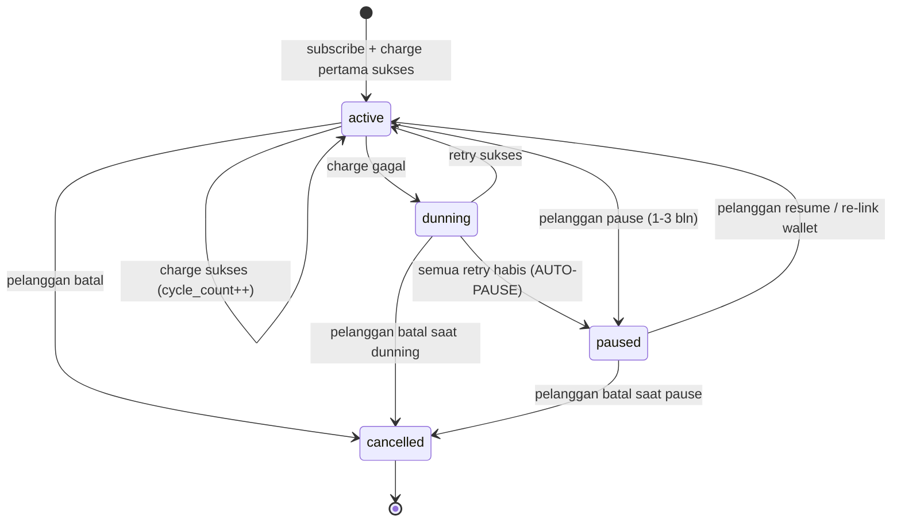
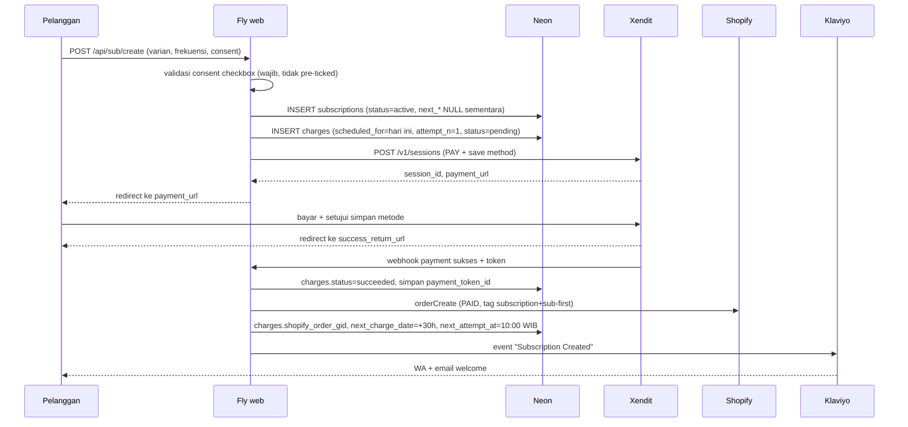

# Treelogy Custom Shopify Subscription App — Spesifikasi Implementasi End-to-End

**Versi 1.0 · 27 Juli 2026**
Dokumen induk. Pasangan: [`workflow_subscription-final-flow_20260723.md`](../workflow_subscription-final-flow_20260723.md) (strategi & CRO) · [`schema.sql`](./schema.sql) (DDL) · [`STRUCTURE.md`](./STRUCTURE.md) (repo & deploy)

---

## 0 · Cara membaca dokumen ini

### 0.1 Legenda status verifikasi

Setiap klaim teknis di dokumen ini ditandai:

| Tanda | Arti |
|---|---|
| ✅ | Diverifikasi lawan sumber live pada 27 Jul 2026. Sumber dicantumkan. |
| ⚠️ | **Belum diverifikasi.** Bentuk yang ditulis adalah dugaan berdasar pola API, dan **wajib dikonfirmasi di Fase 0.4 sebelum ditulis jadi kode.** |
| 🔒 | Keputusan yang mengikat karena komitmen legal di `/policies/subscription-policy`. Mengubahnya berarti mengubah halaman policy lebih dulu. |

Aturan dari playbook yang tetap berlaku: **jangan hardcode bentuk API dari PDF atau dari ingatan.** Semua yang bertanda ⚠️ harus dibuka di docs live dulu.

### 0.2 Prinsip yang mengatur seluruh desain

1. **Database yang menyimpan jadwal, bukan cron.** Cron hanya bertanya "apa yang jatuh tempo". Ini yang membuat retry +6 jam dan reschedule payday-aware jadi sekadar `UPDATE`, bukan konfigurasi infrastruktur.
2. **Setiap jalur yang menyentuh uang punya unique constraint di database.** Logika aplikasi boleh bocor; database tidak boleh ikut bocor.
3. **Idempoten dari ujung ke ujung.** Xendit akan mengirim webhook dua kali. Worker akan crash di tengah. Keduanya harus aman.
4. **Gagal ke arah tidak-menagih, bukan ke arah menagih.** Kalau sistem ragu, jangan tarik uang. Kehilangan satu siklus bisa diperbaiki; menarik uang dua kali merusak kepercayaan permanen.
5. **Janji legal dijalankan sistem, bukan diingat manusia.** Reminder H-3 adalah constraint database, bukan best-effort.

---

## 1 · Ringkasan keputusan arsitektur

### ADR-01 · Tidak memakai Subscription Contract native Shopify

**Keputusan:** langganan hidup sepenuhnya di database kita. Shopify hanya menerima order jadi.

**Alasan:** ✅ `subscriptionBillingAttemptCreate` menagih *vaulted payment method* milik Shopify. Satu-satunya cara memasukkan token pihak ketiga adalah `customerPaymentMethodRemoteCreate`, yang dokumentasinya menyebut secara eksplisit hanya menerima **Stripe, Authorize.Net, atau Braintree** ([shopify.dev/…/customerPaymentMethodRemoteCreate](https://shopify.dev/docs/api/admin-graphql/latest/mutations/customerPaymentMethodRemoteCreate)). Xendit tidak ada, dan tidak ada jalur untuk menambahkannya.

**Konsekuensi yang harus diterima:**
- Scope `write_own_subscription_contracts` **tidak dipakai**. Jangan menambahkannya "untuk jaga-jaga".
- Langganan tidak muncul di admin Shopify sebagai objek langganan → butuh dashboard internal sendiri.
- Halaman "Manage subscription" bawaan Shopify tidak berlaku → butuh customer account extension sendiri.
- Retry, proration, dan reporting jadi tanggung jawab kita sepenuhnya.

### ADR-02 · Fly.io + Neon, bukan Vercel + Supabase

**Alasan:** ✅ Cron Vercel Hobby dibatasi 1×/hari dengan presisi ±60 menit dan expression lebih sering membuat *deployment gagal*. ✅ Fair-use Vercel membatasi Hobby ke non-komersial, dengan *"requesting payments"* disebut eksplisit sebagai commercial usage. ✅ Fly scheduled Machines hanya `hourly`/`daily`/`weekly`/`monthly` dan bersifat *fuzzy* — karenanya penjadwalan pindah ke kolom database dengan worker always-on.

**Konsekuensi:** worker always-on membuat compute Neon tidak pernah autosuspend (biaya tetap, terima saja); webhook WhatsApp yang masih di Vercel Hobby perlu dimigrasi.

### ADR-03 · Frekuensi dalam HARI, bukan bulan

**Keputusan:** `frequency_days` integer. "1 bulan" = 30 hari, "2 bulan" = 60, "3 bulan" = 90.

**Alasan:** aritmetika bulan melahirkan pertanyaan tanggal 31 (langganan mulai 31 Jan, siklus berikutnya kapan?) yang tidak punya jawaban benar dan selalu jadi sumber bug. Aritmetika hari tidak punya kasus tepi sama sekali.

**Konsekuensi copy:** 🔒 storefront tidak boleh menulis "tiap bulan" kalau sistem menagih tiap 30 hari — itu 12,2 tagihan/tahun, bukan 12. Copy yang benar: **"tiap 30 hari"**. Perlu diselaraskan dengan Fase 2c dan halaman policy.

### ADR-04 · Charge pertama dan charge berulang memakai jalur Xendit yang berbeda

- Charge pertama: **Payment Session** (hosted) — pelanggan hadir, bisa melakukan otentikasi/redirect, dan kartu tidak pernah menyentuh server kita (PCI scope minimum).
- Charge berulang: **Payment Request dengan `payment_token_id`** — pelanggan tidak hadir (off-session, MIT).

Detail di §5.

---

## 2 · Batas platform — apa yang TIDAK bisa dilakukan

Ditulis eksplisit supaya tidak ada yang mencoba lagi enam bulan lagi.

| Keinginan | Status | Alasan |
|---|---|---|
| Ganti metode bayar langganan jadi OVO/DANA di halaman akun bawaan Shopify | ❌ Tidak mungkin | Kartu pensil itu memanggil flow vaulted payment method Shopify |
| Menyisipkan block ke halaman "Manage subscription" milik app lain | ❌ Tidak mungkin | ✅ Target block hanya tersedia di permukaan milik Shopify (`profile.*`, `order-index.*`, `order-status.*`) — tidak ada target untuk halaman app pihak lain |
| Halaman akun dengan HTML/CSS bebas | ❌ Tidak mungkin | New customer accounts di-host Shopify; extension wajib komponen Polaris `s-*` |
| Mengedit `templates/customers/*.liquid` untuk mengubah halaman akun | ❌ Tidak berlaku | Store memakai new customer accounts; template klasik itu tidak dirender |
| Tombol langganan masuk cart Shopify | ⛔ Dilarang oleh desain | Aturan fork di final-flow: express-flow 1 produk berdiri sendiri |

**Yang bisa:** membuat halaman penuh sendiri di area akun lewat target `customer-account.page.render`, plus blok di halaman Profile lewat `customer-account.profile.block.render`. ✅

---

## 3 · Model domain & state machine

### 3.1 Status langganan



**Aturan transisi yang mengikat:**

| Dari → Ke | Syarat | Efek pada jadwal |
|---|---|---|
| `active` → `dunning` | charge gagal | `next_attempt_at` = jadwal retry §7.4. `next_charge_date` **tidak berubah** — siklusnya masih siklus yang sama |
| `dunning` → `active` | retry sukses | `next_charge_date += frequency_days`, `next_attempt_at` = 10:00 WIB pada tanggal itu |
| `dunning` → `paused` | retry final gagal | `next_charge_date = NULL`, `next_attempt_at = NULL` |
| `*` → `cancelled` | aksi pelanggan | `next_*` = NULL. 🔒 Retry berhenti total — policy menjanjikan ini |
| `paused` → `active` | aksi pelanggan | 🔒 `next_charge_date` **minimal H+3 dari hari ini** — lihat §3.2 |

### 3.2 Invariant H-3 — kenapa resume tidak boleh menagih besok

🔒 Halaman `/policies/subscription-policy` menjanjikan pengingat 3 hari sebelum setiap tagihan. Kalau pelanggan me-resume langganan dan sistem menagih besok, janji itu **tidak mungkin** ditunaikan.

Karena itu, setiap operasi yang menetapkan `next_charge_date` — resume, reschedule, ubah frekuensi — wajib melewati:

```ts
function assertH3Safe(nextChargeDate: Date, now: Date): void {
  const minimum = addDays(startOfDayWIB(now), 3);
  if (nextChargeDate < minimum) {
    throw new PolicyViolation('next_charge_date melanggar jaminan reminder H-3');
  }
}
```

Ini bukan validasi UX. Ini penegakan janji legal di lapisan kode, dan harus ada test-nya.

### 3.3 Siklus (`scheduled_for`) vs percobaan (`attempt_n`)

Konsep yang paling sering disalahpahami dan sumber bug termahal:

- **Siklus** = `charges.scheduled_for`. Satu siklus = satu pengiriman = satu order = satu penarikan uang.
- **Percobaan** = `charges.attempt_n`. Satu siklus bisa punya 5 percobaan kalau dunning panjang.

Selama dunning, `next_charge_date` **tidak bergerak**. Yang bergerak hanya `next_attempt_at`. Kalau `next_charge_date` ikut maju saat gagal, pelanggan kehilangan satu siklus tanpa sebab dan sistem kehilangan jejak siklus mana yang belum dibayar.

Constraint `charges_one_success_per_cycle` di database adalah yang menegakkan ini.

---

## 4 · Data model

DDL lengkap ada di [`schema.sql`](./schema.sql). Di sini hanya invariant yang tidak terbaca dari DDL.

### 4.1 Invariant yang wajib dipahami sebelum menulis query

| Invariant | Ditegakkan oleh | Kalau dilanggar |
|---|---|---|
| Satu siklus maksimal satu charge sukses | `charges_one_success_per_cycle` | Pelanggan tertagih dua kali |
| Langganan aktif selalu punya jadwal | `subscriptions_running_needs_schedule` | Langganan berhenti menagih diam-diam |
| Reminder H-3 terkirim tepat sekali | `notifications_once_idx` | Melanggar policy, atau spam |
| Webhook diproses sekali | `webhook_events_source_external_uniq` | Order kembar |
| Charge sukses selalu punya order | Job rekonsiliasi + `charges_orphaned_idx` | **Uang diambil tanpa barang dikirim** |

### 4.2 Uang

**`BIGINT` rupiah penuh. Tidak ada float, tidak ada `numeric`, tidak ada sen.**

```
unit_amount_idr      586500       -- harga langganan per unit
shipping_amount_idr   15000
amount_idr           601500       -- yang benar-benar ditarik = (unit × qty) + shipping
```

Total dihitung di aplikasi lalu **disimpan di `charges.amount_idr`** — jangan hitung ulang saat menampilkan riwayat. Kalau harga produk naik tahun depan, riwayat tagihan harus tetap menunjukkan angka yang benar-benar ditarik saat itu.

### 4.3 Waktu

- Storage: `timestamptz` (UTC). Kolom `date` (`scheduled_for`, `next_charge_date`) = tanggal **WIB**.
- Semua aritmetika kalender di aplikasi dengan `Asia/Jakarta`. Indonesia tidak punya DST, jadi tidak ada kasus tepi jam — tapi jangan menganggap UTC+7 hardcoded aman; pakai library timezone.
- **Jam charge: 10:00 WIB.** Bukan tengah malam. Alasan: saldo e-wallet pelanggan lebih mungkin terisi di jam kerja, dan kalau ada masalah, tim ada untuk menanganinya.
- **Jam reminder H-3: 09:00 WIB.**

---

## 5 · Kontrak integrasi Xendit

> ⚠️ **Seluruh bagian ini adalah gate Fase 0.4.** Bentuk di bawah diambil dari docs Xendit pada 27 Jul 2026, tetapi ada inkonsistensi versi yang terlihat langsung di dokumentasi mereka (lihat §5.5). Buka docs live dan konfirmasi sebelum menulis kode.

### 5.1 Peta endpoint

| Kebutuhan | Endpoint | Status |
|---|---|---|
| Charge pertama + simpan token (hosted) | `POST /v1/sessions` dengan `session_type: "PAY"`, `allow_save_payment_method` | ✅ bentuk terlihat di docs |
| Simpan token tanpa menagih | `POST /v1/payment_tokens` (v1) atau `/v3/payment_tokens` | ⚠️ dua versi muncul di docs — konfirmasi |
| Charge berulang dengan token | `POST /v1/payments` dengan `payment_token_id`, `type: "PAY"` | ✅ bentuk terlihat di docs |
| Charge pertama + simpan (tanpa hosted UI) | `POST /v1/payments` dengan `type: "PAY_AND_SAVE"` | ✅ bentuk terlihat di docs |

### 5.2 Charge pertama — Payment Session (jalur yang dipilih)

**Kenapa session, bukan `PAY_AND_SAVE` langsung:** dengan hosted session, data kartu tidak pernah melewati server kita — PCI scope kita tetap SAQ-A. Untuk e-wallet, session juga menangani redirect otentikasi (OVO/DANA butuh pelanggan menyetujui di app mereka).

```jsonc
// POST /v1/sessions
{
  "reference_id": "sub_<subscription_id>_cycle_<scheduled_for>",  // deterministik — kunci idempotensi kita
  "session_type": "PAY",
  "mode": "PAYMENT_LINK",              // atau "COMPONENTS" kalau mau embed di halaman sendiri
  "allow_save_payment_method": "REQUIRED",  // ⚠️ docs menyebut OPTIONAL/REQUIRED/DISALLOWED di satu tempat, dan DISABLED/OPTIONAL/FORCED di tempat lain — KONFIRMASI
  "country": "ID",
  "currency": "IDR",
  "amount": "601500",
  "customer": {
    "reference_id": "<shopify_customer_gid>",
    "type": "INDIVIDUAL",
    "email": "pelanggan@example.com",
    "mobile_number": "+628xxxxxxxxxx",
    "individual_detail": { "given_names": "Kemas", "surname": "S." }
  },
  "items": [
    {
      "reference_id": "<variant_gid>",
      "name": "Treelogy Moringa Capsules",
      "type": "PHYSICAL_PRODUCT",
      "category": "SUPPLEMENT",
      "net_unit_amount": "586500",
      "quantity": "1",
      "currency": "IDR"
    }
  ],
  "description": "Langganan Treelogy tiap 30 hari",
  "success_return_url": "https://sub.treelogy.com/subscribe/done?sid=<subscription_id>",
  "cancel_return_url":  "https://sub.treelogy.com/subscribe/cancelled?sid=<subscription_id>"
}
```

Respons ✅: `{ "session_id": "...", "payment_url": "..." }` → redirect pelanggan ke `payment_url`.

**Jangan percaya `success_return_url` sebagai bukti pembayaran.** Pelanggan bisa menutup tab, atau membuka URL itu manual. Kebenaran hanya datang dari webhook (§5.4). Halaman `done` hanya menampilkan "sedang memproses" sampai webhook masuk.

### 5.3 Charge berulang — Payment Request off-session

```jsonc
// POST /v1/payments
{
  "reference_id": "sub_<subscription_id>_cycle_<scheduled_for>_att_<attempt_n>",  // = charges.idempotency_key
  "payment_token_id": "pt-90392f42-...",
  "type": "PAY",
  "country": "ID",
  "currency": "IDR",
  "request_amount": "601500",
  "capture_method": "AUTOMATIC",   // ⚠️ docs menampilkan "AUTO" di satu tempat dan "AUTOMATIC" di tempat lain — KONFIRMASI
  "channel_properties": {
    "mid_label": "<MID recurring dari Fase 0.2>"   // kartu saja
  },
  "metadata": {
    "subscription_id": "<uuid>",
    "cycle": "2026-08-26",
    "attempt": "1"
  }
}
```

**`reference_id` adalah tulang punggung idempotensi.** Deterministik dari `(subscription_id, scheduled_for, attempt_n)`, dan sama persis dengan `charges.idempotency_key` yang punya unique index di database kita. Kalau worker crash setelah request terkirim tapi sebelum commit, retry menghasilkan `reference_id` identik.

⚠️ Selain itu, konfirmasi di Fase 0.4 apakah Xendit menyediakan **header idempotency** terpisah (`Idempotency-key` / `X-IDEMPOTENCY-KEY`) pada endpoint ini. Kalau ada, pakai keduanya.

**Perilaku e-wallet yang berbeda dari kartu:** charge kartu biasanya sinkron. Charge e-wallet bisa mengembalikan status `PENDING` dan diselesaikan lewat webhook menit kemudian. Kode tidak boleh menganggap "respons 200 = uang masuk". Status di `charges` tetap `pending` sampai webhook konfirmasi.

### 5.4 Webhook

✅ Verifikasi origin — docs menyebut **dua mekanisme berbeda** untuk produk berbeda:
- `x-callback-token`: shared secret, dibandingkan konstan-waktu dengan `XENDIT_WEBHOOK_TOKEN`
- `X-Callback-Signature` (HMAC SHA256) + `X-Callback-Timestamp`

⚠️ **Konfirmasi mana yang berlaku untuk Payments API v3** sebelum menulis handler. Kalau HMAC, wajib juga tolak timestamp yang lebih tua dari 5 menit (anti-replay).

Event yang harus ditangani ✅:

| Event | Aksi |
|---|---|
| `payment_token.success` | Token siap. Simpan `payment_token_id`, `token_expires_at`. Lanjutkan charge pertama kalau flow-nya tokenize-dulu |
| `payment_token.failure` | Tokenisasi gagal — jangan buat langganan. Tampilkan pesan, jangan simpan state setengah jadi |
| `payment_token.expiry` | Token mati. `status` → `paused`, kirim notif re-link. **Jangan cancel** |
| `payment.succeeded` ⚠️ | `charges.status` → `succeeded`, lalu buat order (§6.2) |
| `payment.failed` ⚠️ | `charges.status` → `failed`, masuk dunning (§7.4) |

⚠️ Nama persis event pembayaran (`payment.succeeded` vs `payment_request.succeeded` vs bentuk lain) belum terverifikasi — konfirmasi di Fase 0.4.

**Handler webhook wajib:**

```ts
// 1. Verifikasi signature/token — SEBELUM parsing apa pun
// 2. INSERT ke webhook_events (source, external_id) — kalau konflik, balas 200 dan berhenti
// 3. Balas 200 SECEPATNYA
// 4. Proses di luar request cycle
```

Nomor 3 penting: Xendit akan mengirim ulang kalau kita lambat, dan pengiriman ulang saat proses pertama masih jalan adalah cara paling umum melahirkan order kembar. Balas dulu, proses kemudian — `webhook_events.processed_at` yang melacak.

### 5.5 Daftar konfirmasi Fase 0.4

Bawa daftar ini ke tim Xendit dan ke docs live:

1. ⚠️ `/v1/payment_tokens` vs `/v3/payment_tokens` — mana yang current untuk akun kita
2. ⚠️ Nilai sah `allow_save_payment_method` (`REQUIRED` vs `FORCED`)
3. ⚠️ Nilai sah `capture_method` (`AUTO` vs `AUTOMATIC`)
4. ⚠️ Nama event webhook untuk hasil pembayaran
5. ⚠️ Mekanisme verifikasi webhook untuk Payments v3 (token vs HMAC)
6. ⚠️ Ada/tidaknya header idempotency terpisah
7. ⚠️ **Daftar lengkap `failure_code`** — dibutuhkan untuk tabel §7.5. Tanpa ini, dunning menebak-nebak
8. ⚠️ Umur token per wallet dan apakah ada notifikasi pra-kedaluwarsa
9. ⚠️ Perilaku MIT off-session saat saldo kurang: gagal langsung, atau retry internal Xendit
10. ⚠️ Batas frekuensi charge per token (rate limit dari sisi wallet)

---

## 6 · Kontrak integrasi Shopify

### 6.1 Scope

```toml
scopes = "write_customers,write_orders,write_draft_orders,read_products"
```

`write_own_subscription_contracts` **sengaja tidak ada** (ADR-01). ✅ Validasi schema mengonfirmasi `orderCreate` membutuhkan `write_orders`.

### 6.2 Membuat order setelah charge sukses

✅ Divalidasi lawan Admin GraphQL schema `2026-04` — operasi di bawah lolos validasi.

```graphql
mutation CreateRenewalOrder($order: OrderCreateOrderInput!, $options: OrderCreateOptionsInput) {
  orderCreate(order: $order, options: $options) {
    order {
      id
      name
      displayFinancialStatus
      totalPriceSet { shopMoney { amount currencyCode } }
    }
    userErrors { field message }
  }
}
```

Variabel:

```jsonc
{
  "order": {
    "lineItems": [
      { "variantId": "gid://shopify/ProductVariant/...", "quantity": 1 }
    ],
    "customer": { "toUpsert": { "email": "pelanggan@example.com" } },
    "financialStatus": "PAID",
    "tags": ["subscription", "subscription-renewal"],
    "note": "Xendit charge <xendit_charge_id> · siklus <scheduled_for>"
  }
}
```

Lalu catat referensi charge sebagai metafield order (✅ tervalidasi):

```graphql
mutation RecordChargeReference($metafields: [MetafieldsSetInput!]!) {
  metafieldsSet(metafields: $metafields) {
    metafields { key namespace value }
    userErrors { field message code }
  }
}
```

Namespace yang dipakai: `treelogy_sub` dengan key `xendit_charge_id`, `subscription_id`, `cycle`. Ini yang membuat rekonsiliasi keuangan mungkin dilakukan tanpa membuka database.

**`financialStatus: "PAID"` adalah pernyataan bahwa uang sudah benar-benar diterima.** Jangan pernah membuat order sebelum webhook Xendit mengonfirmasi — order PAID untuk uang yang belum masuk akan merusak pembukuan dan memicu fulfillment atas pembayaran yang mungkin gagal.

### 6.3 Webhook Shopify yang wajib ditangani

| Topic | Kenapa wajib |
|---|---|
| `app/uninstalled` | Bersihkan session. Tanpa ini, app mencoba memanggil API dengan token mati selamanya |
| `customers/data_request` | Kewajiban privasi — wajib untuk app yang di-review |
| `customers/redact` | Hapus PII pelanggan. **Jangan hapus baris `charges`** — catatan keuangan punya kewajiban retensi sendiri; anonimkan, jangan hapus |
| `shop/redact` | Sama, level toko |

### 6.4 Customer account extension

Target ✅: `customer-account.page.render` (halaman penuh + item menu sendiri) dan opsional `customer-account.profile.block.render`.

Batasan yang harus diterima: komponen Polaris `s-*` saja, tidak ada HTML/CSS bebas, jadi tampilan tidak akan 100% sama dengan tema. Jangan menghabiskan waktu mengejar kesamaan visual — habiskan di kejelasan aksi (Skip paling menonjol, sesuai urutan deflect di Fase 3).

---

## 7 · Alur end-to-end

### 7.1 F1 · Subscribe (charge pertama)



**Kasus tepi yang wajib ditangani:**

| Situasi | Perilaku benar |
|---|---|
| Pelanggan menutup tab setelah bayar | Webhook tetap masuk → langganan tetap jadi. Halaman `done` polling status |
| Pelanggan tidak menyelesaikan pembayaran | `charges` tetap `pending`. Job pembersih menandai `abandoned` setelah 1 jam dan **menghapus** baris `subscriptions` yang tidak pernah punya charge sukses |
| Webhook datang dua kali | `webhook_events` menolak yang kedua |
| Webhook sukses tapi `orderCreate` gagal | `charges` tetap `succeeded` dengan `shopify_order_gid` NULL → job rekonsiliasi §9.3 |
| Pelanggan submit form dua kali | `reference_id` deterministik + `charges_cycle_attempt_uniq` menolak duplikat |

### 7.2 F2 · Charge berulang

Worker tick tiap 5 menit:

```sql
begin;
  select id, xendit_token_id, payment_method,
         unit_amount_idr, quantity, shipping_amount_idr,
         next_charge_date
    from subscriptions
   where status in ('active', 'dunning')
     and next_attempt_at <= now()
   order by next_attempt_at
   limit 20
     for update skip locked;
commit;
```

Untuk tiap baris, **urutannya penting**:

1. `INSERT INTO charges (...) VALUES (..., status='pending')` — kalau melanggar unique constraint, artinya sudah ada yang memproses; lewati.
2. **Majukan `next_attempt_at` +15 menit SEKARANG**, sebelum memanggil Xendit. Kalau proses mati saat panggilan jaringan, baris ini tidak diklaim ulang dalam 5 detik dan membanjiri Xendit. Kebenaran tetap dijaga `charges_one_success_per_cycle`.
3. Panggil Xendit `POST /v1/payments`.
4. Simpan hasil. Kartu → biasanya langsung. E-wallet → tunggu webhook.
5. Sukses: order (§6.2) → `next_charge_date += frequency_days` → `next_attempt_at` = 10:00 WIB → `cycle_count++` → event `Charge Succeeded`.
6. Gagal: `status='dunning'` → jadwal retry §7.4 → event `Charge Failed`.

### 7.3 F3 · Pre-charge H-3 🔒

Job harian 09:00 WIB:

```sql
select s.id, s.email, s.phone_e164, s.next_charge_date, s.payment_method
  from subscriptions s
 where s.status = 'active'
   and s.next_charge_date = (current_date at time zone 'Asia/Jakarta')::date + 3
   and not exists (
     select 1 from notifications n
      where n.subscription_id = s.id
        and n.charge_cycle = s.next_charge_date
        and n.kind = 'precharge_h3'
   );
```

Untuk tiap baris: emit event Klaviyo `Upcoming Charge` → `INSERT INTO notifications`. Kalau insert gagal karena unique constraint, artinya sudah terkirim — jangan kirim ulang.

🔒 **Job ini tidak boleh dimatikan, di-skip, atau di-rate-limit.** Kalau job ini gagal, pilihannya adalah menunda charge, bukan menagih tanpa pemberitahuan. Implementasikan sebagai gate:

```ts
// Di dalam F2, sebelum charge:
const notified = await hasPrechargeNotification(sub.id, sub.next_charge_date);
if (!notified && isFirstAttemptOfCycle) {
  await pushChargeBy(sub.id, days(3));   // tunda, jangan tagih
  await alert('Charge ditunda: reminder H-3 belum terkirim', sub.id);
  return;
}
```

Ini menerjemahkan janji di halaman policy menjadi sesuatu yang tidak bisa dilanggar oleh kelalaian operasional.

### 7.4 F4 · Dunning

| Percobaan | Kapan | Kanal |
|---|---|---|
| 1 | jadwal asli, 10:00 WIB | — |
| 2 | +6 jam | WA H0 langsung setelah gagal pertama |
| 3 | +24 jam (jam berbeda: 14:00 WIB) | WA H2 |
| 4 | +72 jam | Email H4 |
| 5 (final) | hari ke-5–7, **payday-aware** | — |
| — | gagal final | 🔒 **AUTO-PAUSE**, bukan cancel |

**Payday-aware:** kalau percobaan final jatuh pada tanggal 20–24, geser ke tanggal 25. Mayoritas gajian di Indonesia turun tanggal 25 atau akhir bulan; menagih tanggal 22 adalah menagih dompet kosong.

```ts
function paydayAwareDate(candidate: Date): Date {
  const dom = dayOfMonthWIB(candidate);
  return dom >= 20 && dom <= 24 ? withDayOfMonth(candidate, 25) : candidate;
}
```

**Batas jaringan kartu** (dari playbook, ⚠️ verifikasi ulang ke acquiring bank): Visa ≤15 percobaan/30 hari, Mastercard ≤10/24 jam. Jadwal di atas jauh di bawah keduanya.

**Kenapa auto-pause, bukan cancel:** 🔒 policy menjanjikannya, dan secara bisnis pelanggan yang di-pause bisa kembali dengan satu ketukan sementara yang di-cancel harus mendaftar ulang. Bedanya di data retensi, bukan cuma sopan santun.

### 7.5 Pemetaan kegagalan → aksi

⚠️ Kode di kolom kiri adalah **placeholder** sampai daftar resmi didapat (Fase 0.4 butir 7).

| Kategori kegagalan | Aksi sistem | Pesan ke pelanggan |
|---|---|---|
| Saldo kurang (e-wallet) | Retry sesuai jadwal | "Biasanya cuma saldo kurang 🙂 Top-up lalu klik: {link retry}" |
| Token kedaluwarsa/dicabut | **Hentikan retry**, langsung pause | "Hubungkan ulang {wallet}: {link}" — retry percuma, token sudah mati |
| Kartu ditolak (sementara) | Retry sesuai jadwal | Netral, jangan menuduh |
| Kartu ditolak (permanen) | Hentikan retry, minta ganti metode | "Kartu ini ditolak bank. Ganti metode: {link}" |
| Error jaringan/5xx Xendit | Retry cepat (+15 menit), **tidak dihitung sebagai attempt dunning** | Diam — ini masalah kita, bukan pelanggan |

Baris terakhir penting: kegagalan infrastruktur kita sendiri tidak boleh memakan jatah retry pelanggan atau memicu WA "pembayaran gagal" yang menakutkan tanpa sebab.

### 7.6 F5 · Aksi portal

Urutan tampilan (deflect-order dari playbook): **Skip → Pause → Ubah frekuensi → Swap → Reschedule → Add-on → Re-link → Batalkan**.

| Aksi | Efek data | Catatan |
|---|---|---|
| Skip | `next_charge_date += frequency_days` | Event `skipped`. Reminder H-3 siklus itu tidak dikirim ulang |
| Pause 1–3 bln | `status='paused'`, `paused_at=now()`, `next_*=NULL` | Simpan durasi di `events.data` untuk auto-resume opsional |
| Ubah frekuensi | `frequency_days` baru, hitung ulang `next_charge_date` dari charge sukses terakhir | Wajib lewat `assertH3Safe` |
| Swap produk | `variant_gid` + `unit_amount_idr` baru | Berlaku **siklus berikutnya**, tanpa proration. Sederhana dan jujur |
| Reschedule | `next_charge_date` baru | Wajib lewat `assertH3Safe` |
| Re-link wallet | Tokenisasi baru → `xendit_token_id` baru | Kalau `status='paused'` karena token mati, resume otomatis (tetap lewat `assertH3Safe`) |
| Batalkan | `status='cancelled'`, simpan `cancel_reason` | 🔒 2 klik, wajib 1 pertanyaan deflection, **bukan** dark pattern |

**Autentikasi portal:** magic link via email/WA, token sekali pakai, umur 15 menit, terikat ke `subscription_id`. Deep-link dari WA H-3 harus bisa Skip/Pause **tanpa login** — itu inti janji "1 klik". Karena itu token deep-link punya scope terbatas (hanya aksi tertentu, hanya satu langganan) dan sekali pakai.

### 7.7 F6 · Nudge token kedaluwarsa

Job harian: `token_expires_at` dalam 7 hari ke depan → WA/email re-link. Menangkap kegagalan sebelum terjadi jauh lebih murah daripada dunning setelahnya.

---

## 8 · Worker & penjadwalan

### 8.1 Anatomi tick

```
tiap 5 menit:
  1. tulis worker_heartbeat
  2. job: charge-due          (klaim FOR UPDATE SKIP LOCKED, batch 20)
  3. job: reconcile-orphaned  (charge sukses tanpa order)
  4. job: process-webhooks    (webhook_events.processed_at IS NULL)

tiap hari 09:00 WIB:
  5. job: precharge-h3
  6. job: token-expiry-nudge
  7. job: cleanup-abandoned
```

### 8.2 Kenapa satu worker cukup (dan kapan tidak)

Dengan batch 20 per 5 menit, satu worker menangani 5.760 charge/hari — jauh di atas kebutuhan. `FOR UPDATE SKIP LOCKED` membuat penambahan worker aman secara desain, tapi **jangan naikkan ke 2 sebelum terbukti di staging**. Concurrency yang belum diuji pada sistem yang menarik uang bukan optimasi, itu risiko.

### 8.3 Koneksi

- `web` → `DATABASE_URL` (pooled, `-pooler`)
- `worker` → `DATABASE_URL_DIRECT`

PgBouncer transaction mode tidak mendukung advisory lock lintas statement, `LISTEN/NOTIFY`, dan sebagian prepared statement.

---

## 9 · Keandalan & rekonsiliasi

### 9.1 Rantai idempotensi

Satu benang merah dari ujung ke ujung:

```
(subscription_id, scheduled_for, attempt_n)
   → charges.idempotency_key           (unique di Neon)
   → Xendit reference_id               (dedup di sisi Xendit)
   → charges.xendit_charge_id          (unique di Neon)
   → charges.shopify_order_gid         (unique di Neon)
   → charges_one_success_per_cycle     (jaring pengaman terakhir)
```

Setiap tautan bisa putus sendiri-sendiri; yang berikutnya tetap menahan.

### 9.2 Yang terjadi kalau proses mati di titik X

| Mati di mana | Akibat | Pemulihan |
|---|---|---|
| Sebelum INSERT `charges` | Tidak ada | Tick berikutnya mengulang |
| Setelah INSERT, sebelum panggil Xendit | Baris `pending` menganggur | Job pembersih menandai `abandoned` setelah 1 jam; siklus dicoba lagi dengan `attempt_n+1` |
| Setelah request Xendit, sebelum respons | **Mungkin uang sudah ditarik** | `reference_id` identik saat retry → Xendit menolak duplikat. Ditambah rekonsiliasi harian §9.4 |
| Setelah charge sukses, sebelum `orderCreate` | Uang ditarik, order belum ada | `charges_orphaned_idx` + job rekonsiliasi §9.3 |
| Setelah order, sebelum update `next_charge_date` | Bisa tertagih ulang | `charges_one_success_per_cycle` menolak. Job perbaikan menyelaraskan jadwal |

### 9.3 Job rekonsiliasi order yatim

```sql
select * from charges
 where status = 'succeeded'
   and shopify_order_gid is null
   and settled_at < now() - interval '2 minutes';
```

Untuk tiap baris: panggil `orderCreate` lagi. Aman karena `charges_order_uniq` mencegah order kedua tercatat.

**Kalau query ini mengembalikan baris lebih dari 10 menit → alert P1.** Ini keadaan "uang pelanggan sudah diambil tapi barangnya belum jadi order".

### 9.4 Rekonsiliasi keuangan harian

Job 23:00 WIB: bandingkan `SUM(charges.amount_idr WHERE status='succeeded' AND DATE(settled_at)=hari ini)` dengan settlement report Xendit hari itu. Selisih apa pun → alert, jangan auto-koreksi. Ini yang menangkap kelas bug yang tidak tertangkap constraint mana pun.

---

## 10 · Keamanan & compliance

### 10.1 PCI

Data kartu tidak pernah menyentuh server kita — hosted session / SDK Xendit. Scope kita SAQ-A. **Jangan pernah** menerima nomor kartu di endpoint sendiri, termasuk "sementara untuk testing".

### 10.2 Bukti consent 🔒

Wajib disimpan literal di `subscriptions`: `consent_text` (teks persis yang dilihat pelanggan, bukan referensi ke versi), `consent_at`, `consent_ip`.

Alasan menyimpan teks penuh dan bukan pointer versi: saat ada sengketa dua tahun lagi, yang harus dibuktikan adalah apa yang pelanggan lihat **saat itu** — bukan apa yang tertulis di versi policy yang sekarang.

Checkbox **tidak boleh pre-ticked**. Ini bukan preferensi UX; aturan consent autodebet OJK (berlaku Jan 2025) adalah butir Fase 0.3 yang masih menunggu jawaban tertulis dari compliance Xendit.

### 10.3 Retensi data vs hak hapus

`customers/redact` dari Shopify: anonimkan `email`, `phone_e164`, `consent_ip` di `subscriptions`. **Jangan hapus `charges`** — catatan transaksi keuangan punya kewajiban retensi yang berbeda dari PII. Simpan `subscription_id` sebagai referensi buram.

### 10.4 Secrets

Semua lewat `fly secrets set`. Tidak ada satu pun di repo. Token webhook Xendit dibandingkan dengan **perbandingan konstan-waktu** (`crypto.timingSafeEqual`), bukan `===`.

---

## 11 · Observability

### 11.1 Yang di-alert

| Alert | Ambang | Prioritas | Kenapa |
|---|---|---|---|
| Heartbeat worker basi | > 15 menit | **P1** | Cron mati diam-diam adalah kegagalan paling berbahaya — tidak mengirim error apa pun |
| Charge sukses tanpa order | ada baris > 10 menit | **P1** | Uang diambil, barang belum diorder |
| Selisih rekonsiliasi harian | ≠ 0 | **P1** | Ada uang yang tidak bisa dijelaskan |
| Tingkat kegagalan charge | > 25% dalam 1 jam | P2 | Kemungkinan Xendit bermasalah atau MID bermasalah |
| Webhook belum diproses | > 100 baris | P2 | Pemrosesan macet |
| Reminder H-3 tidak terkirim padahal ada yang jatuh tempo | > 0 | **P1** 🔒 | Pelanggaran policy sedang berlangsung |

### 11.2 Yang di-log sebagai event

Setiap perubahan state masuk `events` dengan `actor`. Saat pelanggan protes "saya tidak pernah setuju" atau "saya sudah batal minggu lalu", tabel ini satu-satunya jawaban yang bisa dipertanggungjawabkan.

---

## 12 · Strategi pengujian

### 12.1 Unit — aritmetika yang harus benar

- `nextChargeDate()` — termasuk melewati akhir bulan dan tahun kabisat
- `paydayAwareDate()` — tanggal 19, 20, 24, 25, 26
- `assertH3Safe()` — tolak H+0, H+1, H+2; terima H+3
- Perhitungan total: `(unit × qty) + shipping`, integer, tanpa pembulatan
- Konversi zona: 10:00 WIB → UTC, di sekitar pergantian tahun

### 12.2 Integrasi (Xendit test mode)

| Skenario | Harus menghasilkan |
|---|---|
| Charge sukses | `succeeded` + order dibuat |
| Charge gagal saldo kurang | `dunning`, retry terjadwal, WA H0 |
| Charge gagal token mati | `paused` langsung, **tanpa** retry |
| Webhook datang dua kali | Satu order saja |
| Webhook datang sebelum respons API dicatat | Tidak ada state rusak |
| Charge sukses tapi `orderCreate` error | Rekonsiliasi menyelesaikan dalam < 5 menit |
| Dua worker jalan bersamaan | Tidak ada charge ganda |

### 12.3 Skenario chaos (wajib sebelum produksi)

1. Matikan worker di tengah batch → tidak ada charge ganda saat hidup lagi
2. Buat Neon tidak bisa dihubungi 30 detik saat charge → tidak ada uang hilang jejak
3. Kirim webhook dengan signature salah → ditolak, tercatat
4. Kirim webhook lama (replay 1 jam lalu) → ditolak
5. Submit form subscribe dua kali cepat → satu langganan

### 12.4 E2E (Fase 6)

`subscribe → charge → order → H-3 → skip → charge → gagal → dunning → recover → pause → resume → cancel → win-back` — tiap cabang, di branch Neon `staging`, dengan Xendit test mode.

---

## 13 · Deploy & environment

### 13.1 Environment

| Env | Fly app | Neon branch | Xendit |
|---|---|---|---|
| dev | lokal | branch `dev` | test mode |
| staging | `treelogy-subscriptions-staging` | branch `staging` | test mode |
| production | `treelogy-subscriptions` | `main` | live |

Branching Neon adalah alasan utama memilihnya — branch `staging` bisa dibuat dari snapshot produksi dalam hitungan detik untuk menguji migrasi lawan data nyata.

### 13.2 Prosedur migrasi

1. Buat branch Neon dari produksi
2. Jalankan migrasi di branch, jalankan test suite lawannya
3. Baru terapkan ke `main`, **lalu** deploy kode
4. Migrasi wajib backward-compatible satu versi — kode lama harus tetap jalan sebentar saat rolling deploy

**Jangan pernah** menjalankan migrasi yang menghapus kolom bersamaan dengan deploy yang berhenti memakainya. Pisahkan jadi dua rilis.

### 13.3 Rollback

Kode: `fly releases` → `fly deploy --image <versi sebelumnya>`.
Database: **tidak ada rollback otomatis.** Karena itu aturan backward-compatible di atas bukan formalitas.

Sebelum rollback apa pun yang menyentuh logika penagihan: **hentikan worker dulu** (`fly scale count worker=0`), baru rollback, baru hidupkan. Worker versi lama yang berjalan atas schema baru bisa menagih salah.

---

## 14 · Runbook insiden

### 14.1 "Pelanggan tertagih dua kali"

1. `select * from charges where subscription_id = ? order by scheduled_for, attempt_n`
2. Kalau dua baris `succeeded` di `scheduled_for` sama → **constraint dilanggar, artinya index hilang**. Cek `\d charges`. Ini P0.
3. Kalau `scheduled_for` berbeda → bukan double charge, tapi jadwal terlalu rapat. Cek `events` untuk perubahan `next_charge_date`.
4. Refund lewat Xendit, catat di `events` dengan `actor='admin:<email>'`.
5. 🔒 Policy menjanjikan refund untuk kesalahan penagihan — jalankan tanpa berdebat.

### 14.2 "Tidak ada charge yang jalan hari ini"

1. `select * from worker_heartbeat` — basi?
2. `fly status` — machine worker hidup?
3. `fly logs -a treelogy-subscriptions --instance worker`
4. Cek `subscriptions_due_idx`: `select count(*) from subscriptions where status in ('active','dunning') and next_attempt_at <= now()` — menumpuk?
5. Setelah worker hidup, **jangan** proses semua tumpukan sekaligus — batasi batch dan awasi, karena tumpukan berarti banyak charge sekaligus.

### 14.3 "Xendit down"

1. Hentikan worker: `fly scale count worker=0` — jangan biarkan percobaan gagal memakan jatah retry dan memicu WA dunning palsu
2. Kegagalan 5xx tidak boleh dihitung sebagai attempt dunning (§7.5) — pastikan pemetaan ini benar sebelum insiden terjadi
3. Setelah pulih, hidupkan dan awasi batch pertama

### 14.4 "Token wallet kedaluwarsa massal"

Terjadi kalau Xendit atau wallet mengubah kebijakan umur token.
1. `select payment_method, count(*) from subscriptions where status='paused' and ... group by 1`
2. Kirim kampanye re-link lewat Klaviyo, jangan satu per satu
3. Jangan cancel apa pun. Paused bisa kembali; cancelled tidak.

---

## 15 · Rollout

Gate peluncuran (dari final-flow): **minimal kartu + DANA aktif.**

1. **Alpha internal** — 5 langganan tim, produksi, nominal kecil, siklus 7 hari untuk mempercepat siklus uji
2. **Soft launch** — 1 produk (Capsules), 20% traffic, A/B PDP box vs tanpa. Ukur take-rate dan CVR guard
3. **Rollout wallet** — tambahkan OVO/ShopeePay/GoPay begitu approval turun. **Tanpa perubahan arsitektur** — hanya nilai enum `payment_method` dan `channel_code`
4. **Rollout produk** — Powder, Oil, Ritual Set

KPI (dari playbook): dunning recovery 50%→70% · cancel-save 20%→34% · voluntary churn <8%→<4% · involuntary <4%→<1,5% · retensi 6 bln 40%→50% · LTV:CAC 3:1→4:1.

---

## 16 · Daftar hal yang masih terbuka

| # | Hal | Pemblokir untuk | Pemilik |
|---|---|---|---|
| 1 | 10 butir konfirmasi API Xendit (§5.5) | Seluruh Fase 1 | Eng |
| 2 | Underwriting MIT per wallet (Fase 0.1) | Rollout wallet | Kemas/Finance |
| 3 | MID recurring kartu (Fase 0.2) | Charge kartu | Finance |
| 4 | Aturan consent OJK tertulis (Fase 0.3) | Copy consent | Kemas |
| 5 | Region Neon & Fly sudah `ap-southeast-1`/`sin`? | Setup — **tidak bisa diubah setelah dibuat** | Eng |
| 6 | Copy "tiap bulan" vs "tiap 30 hari" (ADR-03) | Copy PDP + policy | Kemas |
| 7 | Migrasi webhook WA dari Vercel Hobby | Kepatuhan ToS | Eng |
| 8 | App Shopify Subscriptions native dimatikan kapan | Hindari 2 halaman langganan | Kemas |

---

## 17 · Lampiran

### 17.1 Variabel environment

```bash
# Shopify
SHOPIFY_API_KEY=            SHOPIFY_API_SECRET=
SHOPIFY_APP_URL=            SCOPES=write_customers,write_orders,write_draft_orders,read_products

# Neon
DATABASE_URL=               # pooled — process web
DATABASE_URL_DIRECT=        # direct — process worker + migrasi

# Xendit
XENDIT_SECRET_KEY=          XENDIT_WEBHOOK_TOKEN=
XENDIT_MID_LABEL=           # MID recurring kartu (Fase 0.2)

# Messaging
KLAVIYO_PRIVATE_KEY=        KLAVIYO_LIST_ID=W8pW2A

# Ops
SENTRY_DSN=                 APP_TIMEZONE=Asia/Jakarta
CHARGE_HOUR_WIB=10          PRECHARGE_HOUR_WIB=9
```

### 17.2 Glosarium

| Istilah | Arti di sistem ini |
|---|---|
| **Siklus** | Satu periode langganan = satu pengiriman = satu penarikan. `charges.scheduled_for` |
| **Percobaan** | Satu upaya menagih satu siklus. `charges.attempt_n` |
| **MIT** | Merchant-Initiated Transaction — charge tanpa pelanggan hadir |
| **Off-session** | Sama dengan MIT, istilah yang dipakai Xendit |
| **Dunning** | Rangkaian retry + pesan setelah charge gagal |
| **Deflection** | Menawarkan alternatif sebelum menerima pembatalan |
| **H-3** | Tiga hari sebelum tanggal tagihan. 🔒 Komitmen legal |

### 17.3 Sumber yang diverifikasi 27 Jul 2026

- `customerPaymentMethodRemoteCreate` — hanya Stripe/Authorize.Net/Braintree — shopify.dev Admin GraphQL
- `orderCreate`, `tagsAdd`, `metafieldsSet` — divalidasi lawan schema Admin `2026-04`, lolos
- Target customer account extension — daftar lengkap dari Shopify AI Toolkit
- Batas cron & fair-use Vercel Hobby — vercel.com/docs
- Scheduled Machines & `auto_stop_machines` Fly — fly.io docs
- Pooled vs direct connection Neon — neon.com/docs
- `PostgreSQLSessionStorage` — @shopify/shopify-app-session-storage-postgresql
- Bentuk Payment Session / Payment Token / Payment Request Xendit — docs.xendit.co/apidocs (**dengan inkonsistensi versi yang dicatat di §5.5**)
